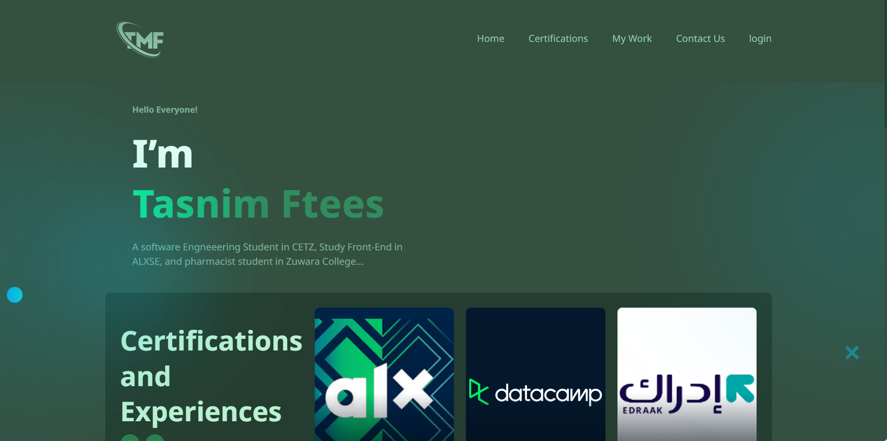
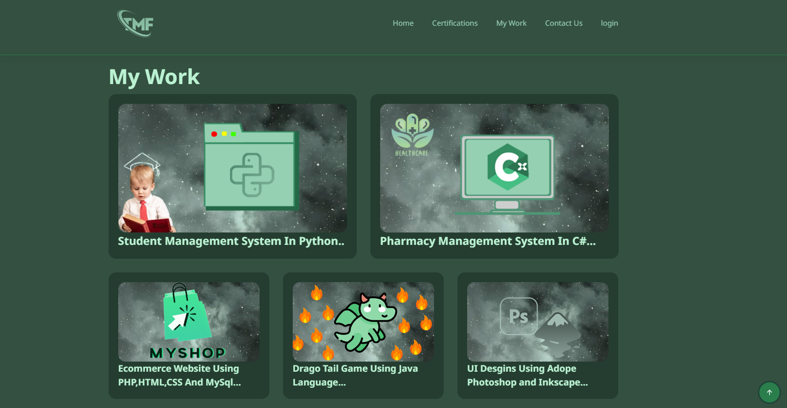
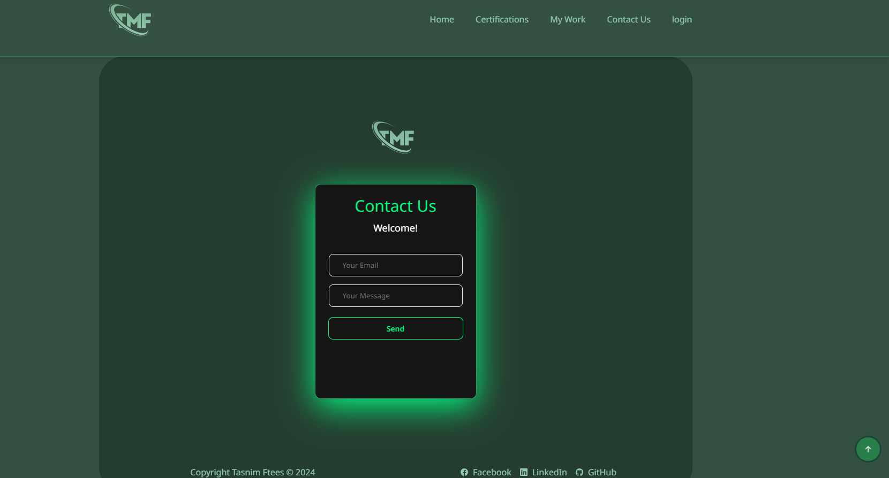

# ALX Final Portfolio Project

Static Personal Portfolio Website Using HTML CSS & JavaScript

## Team of the Project

- Tasnim Ftees
- Working solo on this project

### Goals
- To create a personally appealing portfolio website.
- To showcase skills in HTML, CSS, and JavaScript.

### Tools Used
- HTML for structuring the webpage.
- CSS for styling and layout.
- JavaScript for interactivity.

### Challenges
- Challenge: Making the website responsive across different devices.
- 
## Achievements
- Successfully implemented an appealing design that looks great.
- Enhanced user experience with interactive elements and smooth scrolling.
